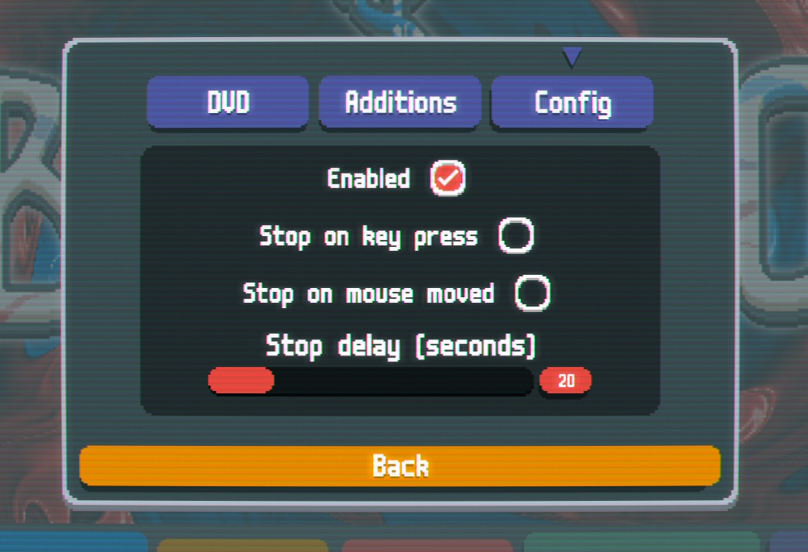

## Requirements
- [Steamodded](https://github.com/Steamopollys/Steamodded) - a Balatro mod loader ([installation guide](https://github.com/Steamopollys/Steamodded/wiki/01.-Getting-started)).

## Features

This mod will add a DVD logo bouncing off your screen after some time of inactivity.

To customize the mod, navigate to Mods -> DVD -> Config

## Credits

DVD shader is created by [tdhooper](https://www.shadertoy.com/view/wtcSzN), and modified by me to only display the DVD logo.
Default [shadertoy license](https://www.shadertoy.com/terms) applies ([CC BY-NC-SA 3.0](https://creativecommons.org/licenses/by-nc-sa/3.0/legalcode.txt)).
